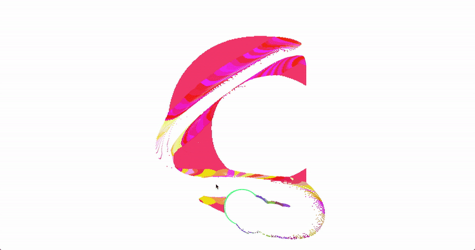
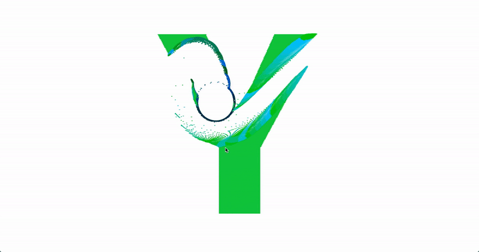

# Kinetic-Typography-2
Kinetic Typography with PIXI
This practice shows color changing effect.
Projects for Practicing Creative, Interactive Coding (with YouTube tutorials)

[GO TO THE PAGE>>](https://yooheana.github.io/Kinetic-Typography-2/)

Details
-------------
* after touching specific part, the color changes and then turns back.
* your mouse movement can sprinkle the letters
* keep the pointer outside for few seconds, then the words would be original
      
      
## Built With

* JavaScript Canvas
